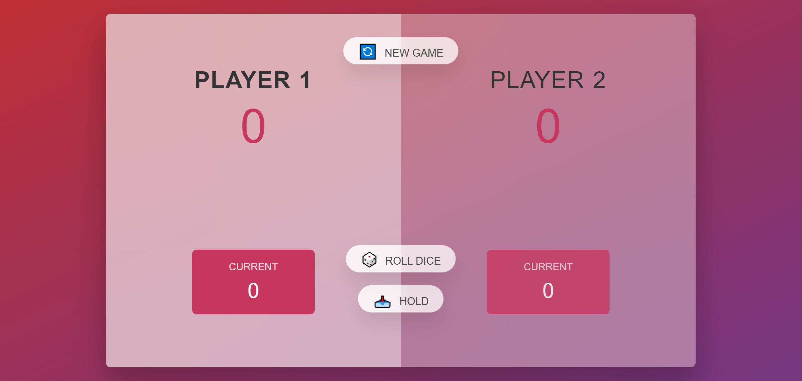

# Pig-Game 🐷

[Pig Game](https://shakiba-vakili.github.io/Pig-Game/) (dice game) is a simple dice game first described in print by John Scarne in 1945.
Players take turns to roll a single dice as many times as they wish, adding all roll results to a running total, but losing their gained score for the turn if they roll a 1.

